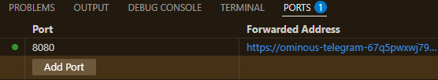
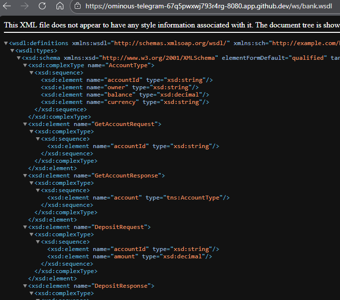
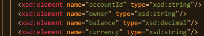
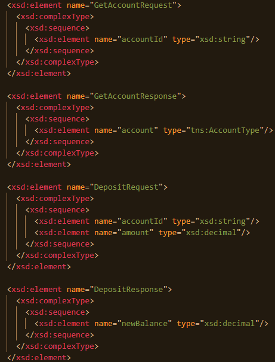
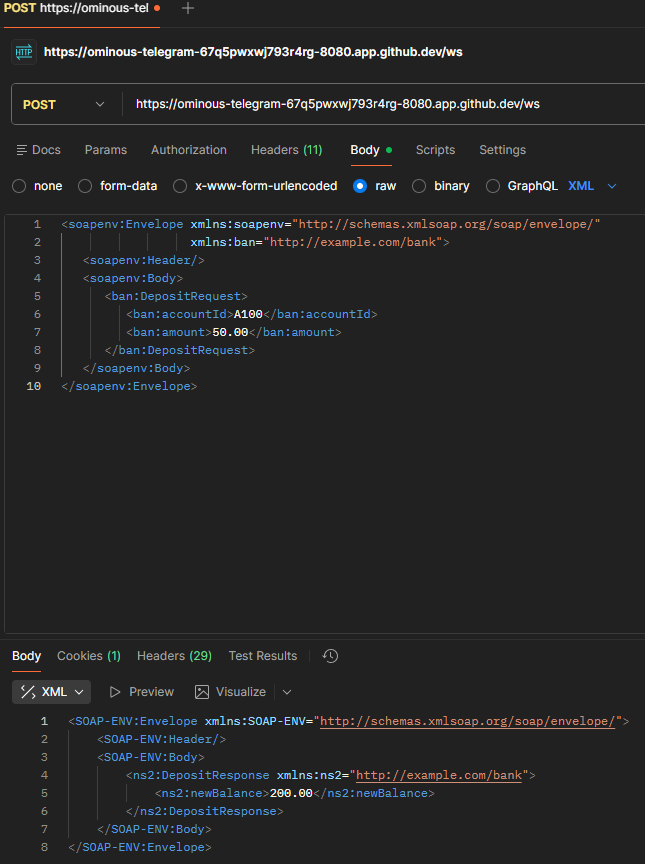
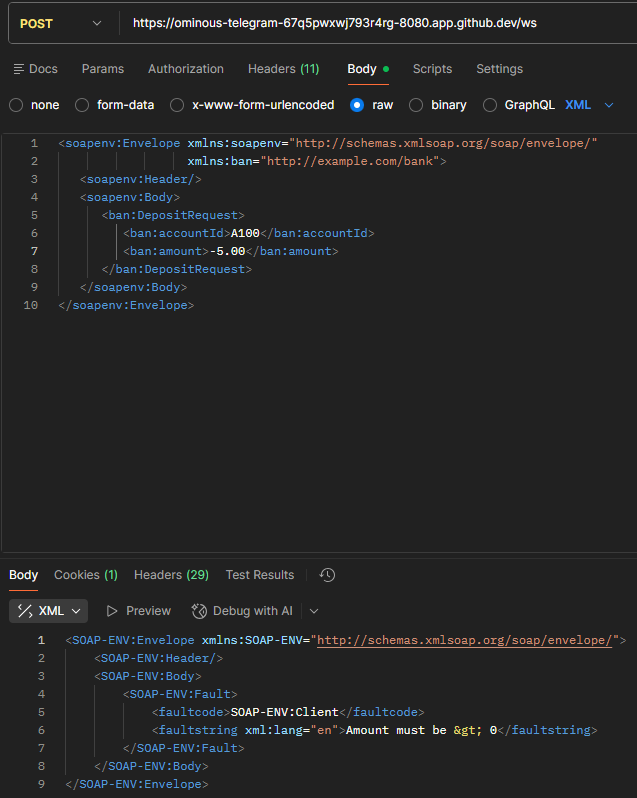
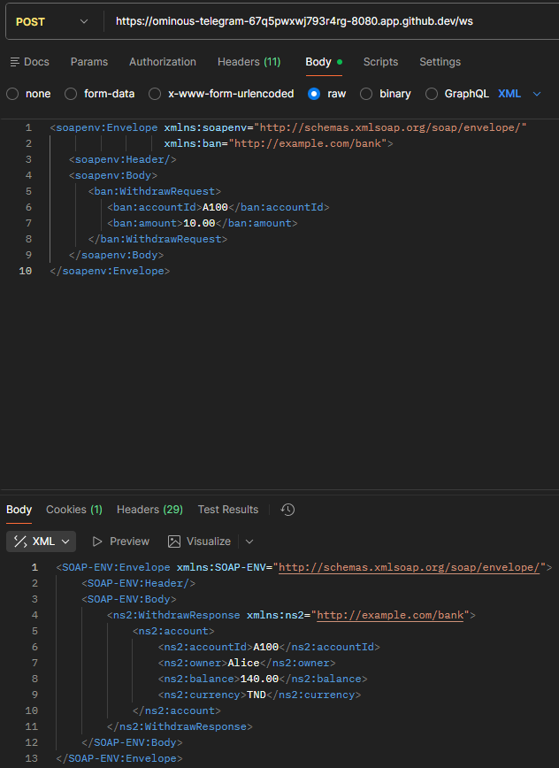
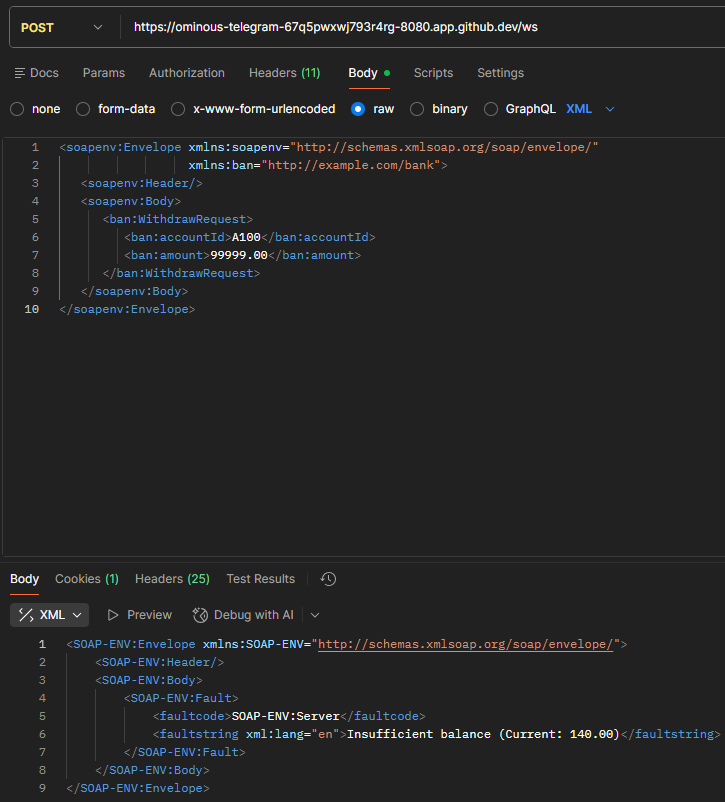

# TP2 : SOA/SOAP avec Java (Spring-WS)

**Nom/Prénom :** Khaled Blel
**Groupe :** DS G2

---

## A) Fork, clone et exécution

### Étapes réalisées
- [x] Fork du dépôt `soap-bank` sur GitLab.
- [x] Clone du fork en local.
- [x] Compilation (`mvn clean package`) et lancement (`mvn spring-boot:run`).
- [x] Vérification du WSDL via le navigateur.

### Preuves d'exécution




---

## B) Lecture du contrat

### 1. Identifier le fichier XSD et expliquer son rôle
**Fichier :** `src/main/resources/bank.xsd`

**Rôle :**
Le fichier XSD représente le **contrat de service**. Dans une approche "Contract-First", il est la source de vérité. Il définit :
1. La structure exacte des messages XML acceptés et renvoyés.
2. Les types de données.
3. Les champs obligatoires.
C'est à partir de ce fichier que Spring-WS génère automatiquement le WSDL et les classes Java.

### 2. Lister les éléments de requête/réponse
D'après l'analyse du fichier `bank.xsd`, voici les éléments définis :

**Objets de données:**
*   **Account :**
    *   `accountId` (string)
    *   `owner` (string)
    *   `balance` (double)
    *   `currency` (string)

    

**Opérations :**
*   **GetAccount :**
    *   Requête : `GetAccountRequest` (contient `accountId`).
    *   Réponse : `GetAccountResponse` (contient l'objet `account`).
*   **Deposit :**
    *   Requête : `DepositRequest` (contient `accountId` et `amount`).
    *   Réponse : `DepositResponse` (contient l'objet `account` mis à jour).

    

### 3. Analyse du WSDL
En observant le fichier `bank.wsdl` généré :

*   **Target Namespace :** `http://example.com/bank`
*   **PortType :** `BankPort`
*   **Opérations :** `GetAccount`, `Deposit`.
*   **Endpoint (URL) :** `http://localhost:8080/ws` **(dans notre cas on remplace localhost par le lien de GitHub codespaces)**
*   **Binding SOAP :** SOAP 1.1 (indiqué par `soap:binding style="document"` transport HTTP).

---

## C) Tests Postman (Analyses)

**Test 1 : GetAccount**


**Test 2 : Deposit**



**Test 3 : Cas d'erreur**
Nous avons tenté de déposer un montant négatif (`-5`).

*Observation :*
Le service a renvoyé une balise `<SOAP-ENV:Fault>`.
*   **faultcode :** `SOAP-ENV:Client` indique que l'erreur vient des données envoyées par le client.
*   **faultstring :** Le message d'erreur défini dans le service.



---
## D) Ajout d’une fonctionnalité

### 1. Fonctionnalité choisie
**Opération :** `Withdraw`
Cette opération permet de débiter un montant spécifique d'un compte, à condition que le solde soit suffisant.

### 2. Mise à jour du contrat (XSD)
Nous avons modifié le fichier `src/main/resources/bank.xsd` pour respecter l'approche **Contract-First**.

**Ajouts dans `bank.xsd` :**
```xml
<!-- Requête de retrait : ID du compte + Montant -->
<xsd:element name="WithdrawRequest">
    <xsd:complexType>
        <xsd:sequence>
            <xsd:element name="accountId" type="xsd:string"/>
            <xsd:element name="amount" type="xsd:decimal"/>
        </xsd:sequence>
    </xsd:complexType>
</xsd:element>

<!-- Réponse de retrait : Retourne l'objet Account complet mis à jour -->
<xsd:element name="WithdrawResponse">
    <xsd:complexType>
        <xsd:sequence>
            <xsd:element name="account" type="tns:AccountType"/>
        </xsd:sequence>
    </xsd:complexType>
</xsd:element>
```

### 3. Implémentation Côté Serveur
Les classes ont été régénérées via `mvn clean compile`.
*   **Service (`BankService.java`) :** Ajout de la méthode `withdraw`. Elle vérifie si le compte existe, si le montant est positif, et surtout si `solde_actuel >= montant_retrait`. Si ce n'est pas le cas, une exception est levée.
*   **Endpoint (`BankEndpoint.java`) :** Ajout de la méthode exposée `@PayloadRoot(..., localPart = "WithdrawRequest")`. Elle appelle le service et mappe l'objet métier interne vers l'objet `AccountType` généré par JAXB.

---
### 4. Tests Postman

#### Test Nominal : Retrait Valide
Nous effectuons un retrait de **10.00** sur le compte **A100**.

*Requête XML :*
```xml
<soapenv:Envelope xmlns:soapenv="http://schemas.xmlsoap.org/soap/envelope/"
                  xmlns:ban="http://example.com/bank">
   <soapenv:Header/>
   <soapenv:Body>
      <ban:WithdrawRequest>
         <ban:accountId>A100</ban:accountId>
         <ban:amount>10.00</ban:amount>
      </ban:WithdrawRequest>
   </soapenv:Body>
</soapenv:Envelope>
```

*Résultat attendu :* Le solde diminue (ex: passe de 150.00 à 140.00).




#### Test d'Erreur : Solde Insuffisant
Nous tentons de retirer un montant supérieur au solde disponible (ex: **99999.00**).

*Requête XML :*
```xml
<soapenv:Envelope xmlns:soapenv="http://schemas.xmlsoap.org/soap/envelope/"
                  xmlns:ban="http://example.com/bank">
   <soapenv:Header/>
   <soapenv:Body>
      <ban:WithdrawRequest>
         <ban:accountId>A100</ban:accountId>
         <ban:amount>99999.00</ban:amount>
      </ban:WithdrawRequest>
   </soapenv:Body>
</soapenv:Envelope>
```

*Résultat attendu :* Une réponse **SOAP Fault** indiquant "Insufficient balance".


